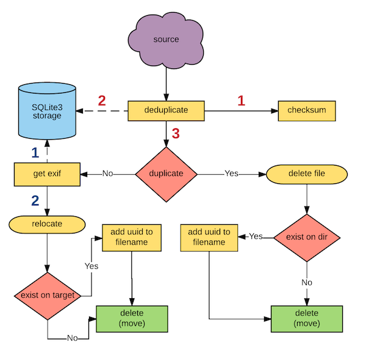

# Design Diagram （设计视图）
设计视图。这个一般是比较高度概括你要做什么的试图。

通常来说，别人看到这个图，就大概明白你做什么（主逻辑）自己在写东西的时候，也可以清晰的对照自己在做哪些部分的东西。

正所谓兵马未动，粮草先行。设计图是开始开发的时候的第一个步骤。（这里并没有把开发前期的设计部分算进去）要写个东西，当自己知道了最终的设计目的跟设计效果之后，那么就是开始画图的时候了。

这里以python中的photo organizer为例子。在定义了我需要做什么之后，就可以开始画图了，画图结束过，照着图，就可以写代码了。（这里跳过了sequence diagram，养成良好的习惯，有了design的diagram跟sequence的diagram之后，再动手写程序）

下图应该不难明白，我们的东西（source）进来只有，有一个去除重复的动作（deduplicate）这个去重复会去要一个checksum（就是md5的值）然后把值记录到存储（sqlite3），去重复会面临两个选择

* 文件是重复的。这个时候删除文件。因为删除并不是永久删除，而是类似丢进一个垃圾站（就是一个目录）所以我们要判断，是否同一个文件名，目录已经有了这个名字了。这里同样是两个选择
	* 存在重复。这个时候，文件名+个uuid，删除（move到垃圾站目录）
	* 不存在重复。直接删除（move到垃圾站）
* 文件没有重复，那么就直接进入下一步

经过去重复后，我想拿到所有图片的exif，所以会有一个读取exif的动作。同时，exif我也希望保存起来（这个后期可以用来做很多东西）所以exif也会有个去存储的链接（sqlite3 storage）存储后，会进入下一个relocate的地方（重新整理）relocate是我像根据照片的exif信息，把照片分门别类的存放。这个程序我只是准备按照年，月，日的形式存放。因为可以是不同的相机，出的照片名字可能会相同。例如猫哥拿个手机照了个照片，名字是123.jpg，猫哥借一个妹子手机，又照了一张，也是123.jpg，这里是同一个天的照片，会在同一个目录下。文件名相同，但是其实是不同的照片（之前md5去重复，就保证照片本身不会重复的）。所以relocate同样涉及两个可能

* 目标目录没有重复的名字，直接移动到目标目录
* 目标目录有重复的，加uuid命名，然后移动到目标目录

从大的方向来看，所有方块类，属于代码部分，所有菱形（红粉色）属于决策。所有圆一点的方块（没有四周边角的）是属结束部分

这样一来，逻辑就基本出来了。就可以照着设计图开始打代码了

