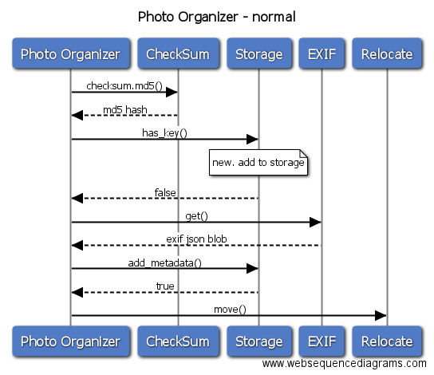
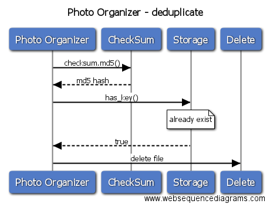

# Sequence Diagram (序列图)

我觉得还是看下百科定义比较好，我表达能力不好，可能形容的不清楚 <http://www.baike.com/wiki/Sequence+Diagram>

简单的说：序列图(Sequence Diagram)是按时间顺序描述了对象间的交互模式；它利用对象的“生命线”和它们之间传递的消息来显示对象如何参与交互。

一个完整的程序，应该都是有序列图的存在的，做的比较好的（认真的架构）序列图中每个call都是定义好的，代码中的call都是可以直接根据序列图中的东西来做。猫哥个人写的东西，说句实话，一般都只有很简单的序列图，以为我画这个有点费时间，不像设计架构图，随手就可以画。但是公司的东西，绝对是画很完整的序列图的（花很多很多时间在这个上）

这里还是以 photo organizer为例子。定好设计视图之后，就粗略的定义了一下sequence diagram

正常的状态。运行一个程序，去找md5()的值，然后通过has_key()去问存储是否已经有过这个md5，存储返回一个Boolean，继续去找exif要图片的exif信息，exif会返回一个json的blob保函所有的exif，然后主程序会去找storage把这个信息用add_metadata()存起来，存储返回Boolean表示存储成功，然后叫relocate中的move()把照片移动到该去的地方

有一个时序图，是不是就很清楚了？之前的架构设计图，那个是可以给任何人看的，而时序图，则是给开发看的。尤其是其他的开发人员。当然了，你自己你写的东西，过个一年半载，你自己可能也很多逻辑细节不记得了，看看自己的时序图，就变得简单很多。

这里检讨一下，因为我是画给自己的简单脚本，人又比较懒，所以画的很简单很简单。这个是我自己偷懒。正常的时序图，木有长这么淳朴的。

这里再定义一个简单的有重复出现的时候的时序图。这里看到，存储告诉我们，md5已经存在了，所以就不会去做exif之类的，直接去要求做删除的动作。

