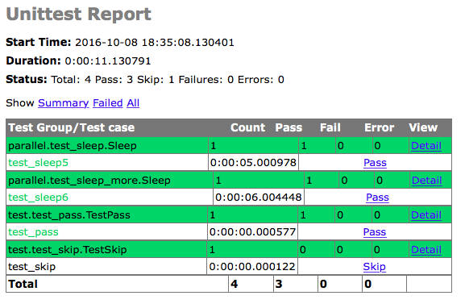

# nosetests

在 [unittest] (UNITTEST.md) 中，已经介绍了什么是unittest以及如何写简单的unittest。

nosetests 是一个第三方的运行unittest的工具。nosetests 填补了很多unittest中缺少的功能。nosetests 可以自动找到所有的test case，不需要写test runner，支持很多的第三方plugin支持多进程平行测试等等。

nosetests 的 [官方网站] (http://nose.readthedocs.io/en/latest/) 有详细的介绍以及文档。python的pip中，也可以找到许多nose相关的插件


## nose tests

```
.
└── test
    ├── __init__.py
    ├── test_pass.py
    └── test_skip.py

1 directory, 3 files
```

当前目录下，创建一个叫做test的目录。在test这个目录中，我们写了两个test的文件，分别是


[test_pass.py] (../src/nosetests/test/test_pass.py)

~~~python
import unittest
import sys
import logging

class TestPass(unittest.TestCase):
    def test_pass(self):
        print "stdout: xxx"
        print >>sys.stderr, ("stderr: yyyy")
        logging.info("info log")
        logging.debug("debug log")
        self.assertEqual(1, 1, '1=1')
~~~

[test_skip.py] (../src/nosetests/test/test_skip.py)

~~~python

import unittest
import sys
import logging

class TestSkip(unittest.TestCase):
    @unittest.skip("skip this test")
    def test_skip(self):
        print "stdout: xxx skip"
        print >>sys.stderr, ("stderr: yyyy skip")
        logging.info("info log skip")
        logging.debug("debug log skip")
        self.assertEqual(1, 1, '1=1')
~~~

nosetests 是不需要自己做test running去load test case的。我们只要目中直接执行 **nosetests** 指令即可

~~~bash
nosetest -v 
test_pass (test.test_pass.TestPass) ... stderr: yyyy
ok
test_skip (test.test_skip.TestSkip) ... SKIP: skip this test

----------------------------------------------------------------------
Ran 2 tests in 0.006s

OK (SKIP=1)
~~~

nosetests 会自动找到我们的test，并且运行。所有的unittest的代码，可以直接在nosetest中直接执行


## Parallel Test

现在我们增加两个新的测试，这两个测试中，有 sleep 的会这个function

[test_sleep.py] (../src/nosetests/parallel/test_sleep.py)

~~~python
import time
import unittest

class Sleep(unittest.TestCase):
    def test_sleep5(self):
        time.sleep(5)
        self.assertTrue(1, 1)
~~~

[test_sleep_more.py] (../src/nosetests/parallel/test_sleep_more.py)

~~~python
import time
import unittest

class Sleep(unittest.TestCase):
    def test_sleep6(self):
        time.sleep(6)
        self.assertTrue(1, 1)
~~~

现在，当前目录如下：

```
.
├── parallel
│   ├── __init__.py
│   ├── test_sleep.py
│   └── test_sleep_more.py
└── test
    ├── __init__.py
    ├── test_pass.py
    └── test_skip.py

2 directories, 6 files
```

现在这里一共有4个测试的程序。我们用nose跑一下

~~~bash
nosetests -v
test_sleep5 (parallel.test_sleep.Sleep) ... ok
test_sleep6 (parallel.test_sleep_more.Sleep) ... ok
test_pass (test.test_pass.TestPass) ... stderr: yyyy
ok
test_skip (test.test_skip.TestSkip) ... SKIP: skip this test

----------------------------------------------------------------------
Ran 4 tests in 11.024s

OK (SKIP=1)
~~~

上面的test一共跑了4个test case，因为其中sleep5跟sleep6里面一共sleep了5秒跟6秒，所以我们看到最后整个测试耗时为**11.024**秒

nosetest 提供多进程同时测试。只要给 **--processes** 选项，告诉nosetest一共多少个进程同时进行就可以。

~~~bash
 nosetests -v --processes=2
stderr: yyyy
test_sleep5 (parallel.test_sleep.Sleep) ... ok
test_pass (test.test_pass.TestPass) ... ok
test_skip (test.test_skip.TestSkip) ... SKIP: skip this test
test_sleep6 (parallel.test_sleep_more.Sleep) ... ok

----------------------------------------------------------------------
Ran 4 tests in 6.141s

OK (SKIP=1)
~~~

上面我们告诉nosetest，用两个进程同时跑我们的测试。我们看到最后总共的耗时是**6.14**秒。基本接近我们test中耗时最长的单个测试（sleep 6）

在大型的测试中，是可以同时跑几十个进程测试的。一般来说，尽力做到整个测试的时间，接近单一测试中最耗时的那个test

## Plugin

nose提供很多的plugin，这里以 nosehtmloutput 为例

~~~bash
pip install nosehtmloutput
~~~

~~~bash
nosetests --with-html-output
~~~

通过 **--with-html-output** 我们开启了nosetests中的htmloutput的plugin，当测试完成后，创建一个[results.html] (results.html) 的文件



nosetests 有很多的plugin可以用。也可以通过pip来搜索plugin

~~~bash
pip search nose
~~~

如果想自己写nosetest的plugin，官方网站中的文档部分，也有专门的介绍
