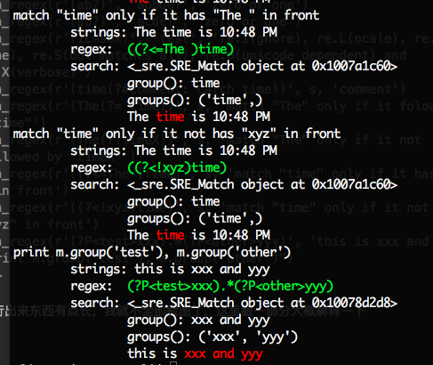

# Regular Expression

这个东西遇到很多人问，不过真的不是很清楚怎么写比较好。

建议就是看两个文档

* 一个是re模组的文档：<https://docs.python.org/2/library/re.html>
* 另外就是Regular Expression HOWTO <https://docs.python.org/2/howto/regex.html>

简单的说，python就是在支持perl的正表达基础上，加了一点自己的东西。自己的额外东西，都是?P开头的

我写了个小的regex的演示，常用的regex都有放进去。并且使用颜色输出，便于查看。至少颜色部分在linux跟osx都没有问题，windows长啥样子就不清楚了

[regex_test.py] (../src/regex/regex_test.py)

~~~python
#!/usr/bin/python
"""
help to understand python regex
"""
import re
def run_regex(regex, string, comment=None, group=True):
    if comment: print comment
    print '\tstrings:', string

    if isinstance(regex, str):
        regex=re.compile(regex)
    print '\tregex:', '\033[92m', regex.pattern, '\033[0m'
    m = regex.search(string)
    print '\tsearch:', m
    if m:
        print '\t\tgroup():', m.group()
        if group:
            print '\t\tgroups():', m.groups()
            print '\t\t%s%s%s' %(string[:m.start()], '\033[91m%s\033[0m' %string[m.start():m.end()], string[m.end():])

s='The time is 10:48 PM'
run_regex(r'\d+', s, 'match any dicimal digit')
run_regex(r'(\D)', s, 'match any non-digit')
run_regex(r'(The\s)', s, 'match any whitespace')
run_regex(r'(\S)', s, 'match non-whitespace')
run_regex(r'(\w)', s, 'match any alphanumeric')
run_regex(r'(\W)', s, 'match any non-alphanumeric')
run_regex(r'([a-z]+)', s)
run_regex(r'([a-zA-Z]+)', s)
run_regex(re.compile(r'(the)', re.IGNORECASE), s, 'ignore case')
run_regex(r'([0-9]{2}:[0-9]{2} (A|P)M)', s, 'normal search with group')
run_regex(r'([0-9]{2}:[0-9]{2} (?:A|P)M)', s, 'no capture group')
run_regex(r'(\btime\b)', s, 'word boundary')
run_regex(r'(\Bim\B)', s, 'not word boundary')
run_regex(r'([0-9]{2}:[0-9]{2} ([AP])M)', s, 'use or in group')
run_regex(r'(time)+', 'The timetime is 10:48 PM', 'match more in group')
run_regex(r'(\b\w+)\s+\1', 'The time time is 10:48 PM', 'detect double words by using backreference')
run_regex(r'(?P<xyz>\b\w+)\s+(?P=xyz)', 'The time time is 10:48 PM', 'detect double words by using named group, also works as: m=regex.match(xxxx) m.group("name")')
run_regex(r'(?!ti)(time)', s, 'negative lookahead')
run_regex(r'(?!xsyz)(time)', s, 'negative lookahead')
run_regex(r'(<.*>)', '<html><head></head></html>', 'greedy')
run_regex(r'(<.*?>)', '<html><head></head></html>', 'non-greedy')
run_regex(r'(ab*)', 'abcdef', 'zero or more')
run_regex(r'(ab*)', 'acdef', 'zero or more')
run_regex(r'(ab+)', 'abcdef', 'one or more')
run_regex(r'(ab+)', 'abbcdef', 'one or more')
run_regex(r'(ab?)', 'abbdef', 'zero or one')
run_regex(r'(ab?)', 'acdef', 'zero or one')
run_regex(r'(iLmsux)', 'test', 're.I(gnore), re.L(ocale), re.m(ult-line), re.S(dot matches all), re.U(unicode dependent) and re.X(verbose)')
run_regex(r'(time(?#comment: catch time))', s, 'comment')
run_regex(r'(The(?= time))', s, 'match "The" only if it folowed by " time"')
run_regex(r'(The(?!timeX))', s, 'match "The" only if it not followed by "timeX"')
run_regex(r'((?<=The )time)', s, 'match "time" only if it has "The " in front')
run_regex(r'((?<!xyz)time)', s, 'match "time" only if it not has "xyz" in front')
run_regex(r'(?P<test>xxx).*(?P<other>yyy)', 'this is xxx and yyy', "print m.group('test'), m.group('other')")
~~~

运行出来东西有点长，我就不全部截图了，这里截一部分大概解释一下

run_regex 定义是(regex, string, comment=None, group=True)

结果中，我们看到的第一行，就是comment哪行，也就是注释部分
绿色的，是我们给的正表达，红色的是match的部分

至于红色match的到底准不准。。。这个我只是随便很粗略的给了一下位置，变了个颜色。复杂的正表达颜色估计会不准的（能写复杂的东西，你应该也用不到这个脚本的）这个而脚本就是帮助初学的可以**视觉化**一下你的正表达，跟最后的结果。其中的group就是re中的group，groups就是groups这个应该都很好理解。
