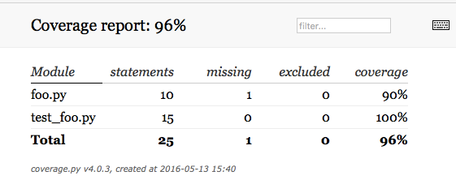
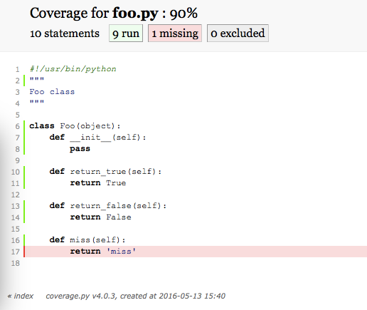

# Unittest

unittest（单元测试）是指对软件中的最小可测试单元进行检查和验证。对于任何的开发来说，测试都是不可缺少的一个环境。Python的
[官方文档](https://docs.python.org/2/library/unittest.html)有非常详细的关于unittest的介绍

## unittest
首先，我们写一个模组Foo的class，保存在foo.py里面

Foo class我们定义了3个method，一个是返回True，一个是返回False，还有一个是返回字符串“miss”

[foo.py](../src/unittest/foo.py)

~~~python
#!/usr/bin/python
"""
Foo class
"""

class Foo(object):
    def __init__(self):
        pass

    def return_true(self):
        return True

    def return_false(self):
        return False

    def miss(self):
        return 'miss'
~~~

如何测试我们写的这个Foo的class达到了设计目的呢？我们需要写代码来验证这个Foo的class是正确的。python本身自带了unittest的模组，所以一切都变得很简单

[test_foo.py](../src/unittest/test_foo.py)

~~~python
#!/usr/bin/python
"""
unittest for test foo.py
"""
import unittest
import foo
class TestFoo(unittest.TestCase):
    def setUp(self):
        self.foo=foo.Foo()
    def tearDown(self):
        del self.foo
    def test_true(self):
        self.assertTrue(self.foo.return_true())
    def test_false(self):
        self.assertFalse(self.foo.return_false())
if __name__=='__main__':
    suite = unittest.TestLoader().loadTestsFromTestCase(TestFoo)
    unittest.TextTestRunner(verbosity=2).run(suite)
~~~

我们这里定义了两个测试，一个是 test_true，用以测试返回值是True，另外一个是 test_false，用来测试返回值是False

如果直接运行这个程序，这里用TestLoader加载了我们写的test case这样这个测试脚本，就可以直接运行

~~~bash
python test_foo.py 
test_false (__main__.TestFoo) ... ok
test_true (__main__.TestFoo) ... ok

----------------------------------------------------------------------
Ran 2 tests in 0.000s

OK
~~~

这里看到，跑了两个 test case，其中一个是 test_false一个是test_true，两个都返回 ok （测试通过）

当前的目录状态如下：

```
.
├── foo.py
└── test_foo.py

0 directories, 2 files
```

## coverage
python中有一个第三方模组叫做coverage，可以帮我们计算python你在跑的时候，到底覆盖了多少的代码。对于脚本语言来说，100%的代码覆盖率是很重要的事情。因为脚本语言是不经过编译的，所以如果没有运行到那个部分，那么错误是看不到的。100%的代码测试覆盖，至少可以说让我们的全部代码都跑了一遍。（实际中，有些时候是没法做到100%的代码覆盖，不过还是尽力去做）

安装coverage
~~~bash
pip install coverage
~~~

现在我们用coverage来跑一下我们的unittest

~~~bash
coverage run test_foo.py
test_false (__main__.TestFoo) ... ok
test_true (__main__.TestFoo) ... ok
----------------------------------------------------------------------
Ran 2 tests in 0.000s
OK
~~~

看上去还是跟以前一样的。其实coverage会产生一个隐藏的档案叫做 .coverage 里面记录了代码覆盖率的信息

运行 coverage report指令，就可以看到这个信息

~~~bash
coverage report
Name          Stmts   Miss  Cover
---------------------------------
foo.py           10      1    90%
test_foo.py      15      0   100%
---------------------------------
TOTAL            25      1    96%
~~~

这里看到，foo.py 的代码覆盖率只有90%，也就是说，有10%的代码，在我们跑unittest的时候，并没有跑到

通过coverage report -m 这个指令，我们可以看到具体的到底哪些行代码没有运行

~~~bash
coverage report -m
Name          Stmts   Miss  Cover   Missing
-------------------------------------------
foo.py           10      1    90%   17
test_foo.py      15      0   100%   
-------------------------------------------
TOTAL            25      1    96%   
~~~

foo.py 中，第17行没有运行到（因为我们并没有测试miss那个method）

coverage 同样也可以直接保存html格式的报告

~~~bash
coverage html
$ ls
foo.py      foo.pyc     htmlcov     test_foo.py
~~~


打开 htmlcov/index.html



因为是html的，可以直接点击 foo.py 就能看到代码，告诉我们那里没有执行



## 开发与测试的模式
一般来说，有两种开发跟测试的模式

第一种是比较传统的模式：写代码，写好代码后，开始写unittest的测试。最后验证unitest都通过了，代码覆盖达到了要求，提交

第二种是近几年比较新的做法，叫做 test driven。也就是说，在你写代码之前，首先开始写unittest的测试。然后测试写好后，再去写代码“满足”你的测试。需要新的功能了，还是一样，先写新的测试，然后代码去满足测试。


