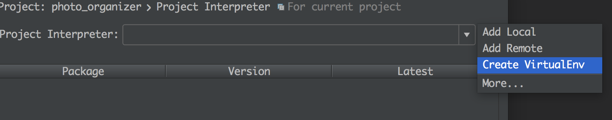

# Virtualenv

virtualenv 是什么？virtulenv 可以理解成是一个python的“虚拟机”
<https://virtualenv.pypa.io/en/stable/>

virtualenv会根据你现有的python环境，创建一份新的python出来。并且通过环境加载这个python。这样允许你有一个“全新干净”的python环境，并且可以安装不同的模组（例如你一个开发环境需要模组a的1.0版本，而另外一个需要2.0的版本）避免模组之间的冲突等等。

例如pycharm这类的IDE，甚至允许你直接在IDE中设定virtulenv

virtulenv 使用非常简单，不过如果你天天用很多，那么可能会发现并不是很方便。第一呢，你要知道自己virtulenv的环境都有哪些，创建了之后还要激活，删除的话需要记住地方。再就是virtulenv会重新做一些你的shell的环境，如果你是用linux或者苹果，然后又有很多设定在.bash_profile里面，很多alise的话，你会发现激活virtulenv的环境后，这些东西都没有了，你需要自己加载。

这里是一个使用virtulenv的例子，用一个python去加载virtulenv，并且接受一个叫做 ~/.python_profile的文件，如果文件存在，你可以设定你所有的shell相关环境在里面。同时提供简单的创建新环境，检查当前环境，删除环境跟激活环境。其中python的设定在pythons这个变量中，因为我是苹果，我所以我设定3个环境，一个是苹果的osx的自带的python，一个是我安装的python2.7.2还有一个是我安装的python3.4

[virtualenv.py](../src/virtualenv/virtualenv.py )

~~~python
#!/usr/bin/python
"""
build new python environment via virtualenv
works on my osx, support osx built-in python
port installed python2.7 and port installed python3.4
"""
import os
import sys
import optparse
import shutil

def main():
    home = os.path.expanduser('~')
    target = os.path.join(home, 'python')
    pythons = { 
            'osx_python2' : '/usr/bin/python', #I use mac, so there's 2 python. one from mac, one from port
            'port_python2': '/opt/local/bin/python2.7',  #port python location
            'port_python3': '/opt/local/bin/python3.4', #python3 location
            }
    virtualenv='/usr/local/bin/virtualenv'

    if not os.path.isdir(target):
        try:
            os.mkdir(target)
        except Exception: 
            raise SystemExit("target directory %s do not exist, and I can't make one" %target)
    for python in pythons: 
        if not os.path.isfile(pythons[python]): 
            raise SystemExit("%s not found on: %s" %(python, pythons[python]))
    if not os.path.isfile(virtualenv):
        raise SystemExit("virtualenv not found from: %s" %virtualenv)

    #name do not want people to use in target directory
    #_protected_=['python2', 'python3']
    _protected_=[]

    parser = optparse.OptionParser() 
    parser.add_option('-3', '--python3', action="store_true", dest='python3', default=False, help = "provision python3 instead python2(default)")
    parser.add_option('-o', '--osx', action='store_true', dest='osx', default=False, help = 'use osx python instead of port python. only works for python2')
    parser.add_option('-s', '--system-site-packages', action='store_true', dest='packages', default=False, help = 'Give access to the global site-packages')
    parser.add_option('-p', '--provision', metavar = "Provision", help = "provision new python virtual instance")
    parser.add_option('-l', '--list', action="store_true", dest='list', help = "list provisioned instances")
    parser.add_option('-a', '--active', metavar = 'Active', help="active this virtual python instance")
    parser.add_option('-d', '--delete', metavar = 'Delete', help="delete the virtual python")
    options, args = parser.parse_args()

    if not options.provision and not options.list and not options.active and not options.delete:
        parser.print_help() 
        sys.exit()

    if options.provision: 
        if options.provision in _protected_:
            raise SystemExit("you can not create: %s, this target is protected" %options.provision)
        if os.path.isdir(os.path.join(target, options.provision)):
            raise SystemExit('target %s already exist' %os.path.join(target, options.provision))
        command = ("%s %s" %(virtualenv, os.path.join(target,options.provision)))
        if options.python3: 
            command +=' -p %s' %pythons['port_python3']
        else:
            if options.osx: 
                command +=' -p %s' %pythons['osx_python2']
            else:
                command +=' -p %s' %pythons['port_python2']
        if options.packages: 
            command += ' --system-site-packages'
        os.system(command)
        open(os.path.join(target, options.provision, 'bin/activate'), 'a').write('\n\n[[ -f ~/.python_profile ]] && source ~/.python_profile\n')
        os.system('/bin/bash --init-file %s' %os.path.join(target, options.provision, 'bin/activate'))

    elif options.delete: 
        if options.delete in _protected_:
            raise SystemExit("you can not delete: %s, this target is protected" %options.delete)
        if not os.path.isdir(os.path.join(target, options.delete)): 
            raise SystemExit("%s do not exist" %(os.path.join(target, options.delete)))
        shutil.rmtree(os.path.join(target, options.delete))

    elif options.list:
        dirs=os.listdir(target)
        for d in dirs:
            if d not in _protected_: 
                print '\t', d

    elif options.active:
        if options.active in _protected_:
            raise SystemExit("you can not use: %s, this target is protected" %options.use)
        if not os.path.isdir(os.path.join(target, options.active)):
            raise SystemExit("%s do not exit" %options.use)

        os.system('/bin/bash --init-file %s' %os.path.join(target, options.active, 'bin/activate'))

if __name__=='__main__':
    main()
~~~

使用方法如下

~~~bash
$ virtualenv 
Usage: virtualenv [options]

Options:
  -h, --help            show this help message and exit
  -3, --python3         provision python3 instead python2(default)
  -o, --osx             use osx python instead of port python. only works for
                        python2
  -s, --system-site-packages
                        Give access to the global site-packages
  -p Provision, --provision=Provision
                        provision new python virtual instance
  -l, --list            list provisioned instances
  -a Active, --active=Active
                        active this virtual python instance
  -d Delete, --delete=Delete
                        delete the virtual python
~~~

我个人的用法（我是python2）直接在我的bash的profile中加入激活python2环境。这样任何时候我开terminal，都是在虚拟的python2环境中，我也可以随时创建新的环境然后激活使用。
