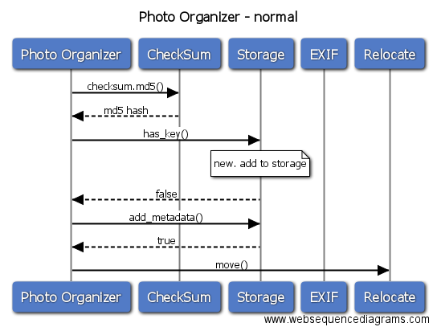

# Photo Mangement 
照片有点多，最近换电脑顺便整理一下（大概200多G）
我的照片都是两份格式，一个是jpg，一个是raw的。所以大致划分一下几个功能

## rsync.sh - 备份照片到外接硬盘

我的东西是在~/Pictures下面，外接备份的硬盘我都有做一个Pictures的目录。用rsync做备份。简单的bash搞定就好。我平时有2个硬盘做备份，所以随便哪个硬盘，插入之后，跑rsync.sh就会把照片备份到外接硬盘。

[rsync.sh](rsync.sh)

~~~bash
#!/bin/bash
source=$HOME/Pictures
targets=$(ls -d /Volumes/*/Pictures 2>/dev/null)
if [[ ! -d $source ]]
then
    echo "$source not found" 1>&2
    exit 1
fi
if [[ -z $targets ]]
then
    echo "no target found" 1>&2
    exit 1
fi

for target in $targets
do 
    if [[ ! -d $target ]] 
    then 
        echo "$target no longer exist... skip " 1>&2
    else
        echo "rsync from $source to $target start" 
        rsync -av $source/* $target/
    fi
done
~~~


## delete\_raw\_from_jpg.py

因为拍照都是一份jpg的格式，一份raw的格式。raw文件很大，一般是做照片处理的时候才用。每次照片回来，我会在电脑里面看jpg效果，不喜欢的就删除。所以需要一个东西，对应删除raw部分。例如，001.jpg如果删除了，那么我希望可以删除001.raw这类的格式（每个相机的raw格式结尾不同）

[delete_files.py](lib/delete_files.py)

~~~python
#!/usr/bin/env python
"""
delete raw picture based on the not exist of jpg
"""
import sys
import os
import shutil
import uuid

def move_file(filename, target = '.delete'):
    newname = os.path.basename(filename)
    if os.path.isfile(os.path.join(target, os.path.basename(filename))):
        newname = 'uuid-%s-%s' % (uuid.uuid4(), os.path.basename(filename))
    if not os.path.isdir(target):
        os.makedirs(target)
    shutil.move(filename, os.path.join(target, newname))
        
def delete_raw_from_jpg(jpg, raw, delete_dir='.delete'):
    jpg_files = [x.split('.')[0] for x in os.listdir(jpg)]
    raw_files = os.listdir(raw)
    if not os.path.isdir(delete_dir):
        os.mkdir(delete_dir)
    for x in raw_files:
        if x.split('.')[0] not in jpg_files:
            x = os.path.join(raw, x)
            if os.path.isfile(x):
                move_file(x, delete_dir)
~~~

## 初步设计

上面rsync.sh跟raw文件清除，我作为独立的部分。下面就是初步设计一下东西进来，要怎么去做处理。

这里就不重复了，我是这个一个东西，刚好可以当做例子，讲解设计视图部分的东西。所以具体讲解部分，如果想看，可以直接看：[设计视图部分](../../../diagram/docs/DESIGN.md)

初步设计架构如下


## sequence diagram 
粗略做一下顺序图




## exif.py

根据文件名，返回一个这个图片的exif信息

[exif.py](lib/exif.py)

~~~python
"""
exif reader
will accpet a filename then try to read exif data from that file
will return dict wih exif info

seems the best library I can find for exif is: https://wiki.gnome.org/Projects/gexiv2
however I can't get it working under osx with virtulenv.
so use http://tilloy.net/dev/pyexiv2/overview.html instead
"""
import pyexiv2
import fractions
import datetime
import time
import os
import json

def get(filename):
    tags = {} 
    if not os.access(filename, os.R_OK):
        return tags
    metadata = pyexiv2.ImageMetadata(filename)
    metadata.read()
    keys = metadata.keys()
    for key in keys:    
        value = None
        tag = metadata[key]
        try:
            if not isinstance(tag.value, (int, str, long, fractions.Fraction, datetime.datetime)): continue
            
            if isinstance(tag.value, fractions.Fraction):
                value = float(tag.value)
            elif isinstance(tag.value, datetime.datetime):
                value = time.mktime(tag.value.timetuple())
            elif isinstance(tag.value, str):
                value = tag.value.strip()
            else:
                value = tag.value
            if tag.name:
                #make sure we can dump into json, so we can use it in db
                try:
                    json.dumps({tag.name: value,})
                    tags.setdefault(tag.name, value)
                except:
                    pass
        except:
            pass
    
    return tags
~~~

## relocate.py

根据exif信息，照片按照年月放到不同的目录


```
├── 2015  #年
│   ├── 01 #月
│   │   ├── 01 #日
└── 2016
    ├── 01
    │   ├── 01
    │   ├── 02
    ├── 02
    │   ├── 01
    │   ├── 02
    │   └── 03
    └── 03
        ├── 01
        ├── 02
        └── 03

```

[relocate.py](lib/relocate.py)

~~~python
"""
relocate files to target directory based on exif datetime
"""
import time
import os
import shutil
import uuid

def move((filename, epoch_time), target):
    timestamp = time.gmtime(float(epoch_time))
    target_dir = os.path.join(target,
                          str(timestamp.tm_year),
                          str(timestamp.tm_mon).zfill(2),
                          str(timestamp.tm_mday).zfill(2))
    if not os.path.isdir(target_dir):
        os.makedirs(target_dir)
    target_file = os.path.join(target_dir, os.path.basename(filename))
    if os.path.isfile(target_file):
        target_file = os.path.join(target_dir, 'uuid-%s-%s' % (uuid.uuid4(), os.path.basename(
                                                                                             filename)))
    shutil.move(filename, target_file)
~~~

## checksum.py

作为去除重复，给一个文件名，返回md5的值

[checksum.py](lib/checksum.py)

~~~python
"""
return md5 of a file
"""
import os
import hashlib

def md5(filename):
    if not os.access(filename, os.R_OK):
        return
    m = hashlib.md5()
    m.update(open(filename, 'rb').read())
    return m.hexdigest()
~~~


## storage.py

后台存储。这里我用sqlite3来做。当然了，只要保持界面，可以用任何方式做存储。

[storage.py](lib/storage.py)

~~~python
"""
backend storage engine
using sqlite3. can switch to any other backend (just keep the same interface)
"""

import sqlite3

class Storage(object):
    """sqlite3 backend stroage
    """
    def __init__(self, dbname='.metadata.sqlite3'):
        """setup sqlite connection.
        use autocommit
        """
        self.__conn__=sqlite3.connect(dbname)
        self.__conn__.isolation_level=None
        self.__cursor__=self.__conn__.cursor()
        self._initdb_()

    def _initdb_(self):
        """init sqlite3 db
        """
        self.__cursor__.execute("create table if not exists data (name text, data char(32) unique)")
        self.__cursor__.execute("create table if not exists metadata (name text unique, data text)")

    def has_key(self, name, data):
        """check if the file with data already exist
        return True if storage already has this data
        return False if data already exist
        """
        try:
            self.__cursor__.execute("insert into data (name, data) values (?, ?)", (name, data))
        except sqlite3.IntegrityError:
            return True
        return False

    def remove_key(self, name=None, data=None):
        """remove a record from storage by name or data or both
        """
        if not name and not data:
            return None
        if name and data:
            self.__cursor__.execute("delete from data where name=? and data=?", (name, data))
        else:
            if name:
                self.__cursor__.execute("delete from data where name=?", (name,))
            else:
                self.__cursor__.execute("delete from data where data=?", (data,))
        return True

    def fetch_key(self, name=None, data=None):
        """fetch record by name or data or both
        return None or sqlite.fetchmany()
        """
        if not name and not data:
            return None
        if name and data:
            self.__cursor__.execute("select name, data from data where name=? and data=?", (name, data))
        else:
            if name:
                self.__cursor__.execute("select name, data from data where name=?", (name, ))
            else:
                self.__cursor__.execute("select name, data from data where data=?", (data, ))
        return self.__cursor__.fetchmany()

    def add_metadata(self, name, data):
        """add metadata
        return True if data saved to stoage
        return False if data already exist
        """
        try:
            self.__cursor__.execute("insert into metadata values (?, ?)", (name, data))
        except sqlite3.IntegrityError:
            return False
        return True

    def remove_metadata(self, name=None, data=None):
        """remove metadata from storage by name, or data or both
        """
        if not name and not data:
            return None
        if name and data:
            self.__cursor__.execute("delete from metadata where name=? and data=?", (name, data))
        else:
            if name:
                self.__cursor__.execute("delete from metadata where name=?", (name,))
            else:
                self.__cursor__.execute("delete from metadata where data=?", (data,))
        return True

    def fetch_metadata(self, name=None, data=None):
        """fetch metadata by name or data or both
        return None or sqlite.fetchmany()
        """
        if not name and not data:
            return None
        if name and data:
            self.__cursor__.execute("select name, data from metadata where name=? and data=?", (name,data))
        else:
            if name:
                self.__cursor__.execute("select name, data from metadata where name=?", (name,))
            else:
                self.__cursor__.execute("select name, data from metadata where data=?", (data,))
        return self.__cursor__.fetchmany()

    def close(self):
        self.__cursor__.close()
        self.__conn__.close()
~~~


## views 
还没时间做。因为我们有文件的exif信息，所以可以根据这些信息做任意的“视觉”排序。我一般的做法是直接以目录形式，然后放软连接（soft link）来做这样的事情。

分类可以是很多种，exif提供很多信息，这里举例我一般的分类习惯

* 按照相机分类（相机名字，年，月，日）
* 按照镜头分类 （镜头名字，年，月，日）
* 按照光圈分类（同光圈的在一个目录下）
* 快门分类（同样快门速度的在一个目录下）
* iso分类（同样iso的在一个目录下）
* 闪光灯分类（是否有开启闪光灯）
* 黑白模式 （黑白根彩色照片分开）这个因为是要独立的代码，并不能通过storage内有的数据完成，所以这个模组已经写了[blackwhite.py] (lib/blackwhite.py)

## test
当然了，写代码必须要有unittest的
所有的模组的test都在 [test](test/) 下面

基本接近100%的代码覆盖吧