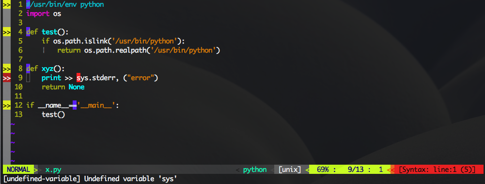

# VIM 设定

这里是我的vim的设定文件 [vimrc] (../src/vimrc)

包括了一些基本的设定

一些plugin （主要是python相关），plugin用Vundle安装

还有一些定义的function

使用方法，下载 [vimrc] (../src/vimrc) 后

```
cp vimrc ~/.vimrc 
mkdir ~/.vimrc
git clone https://github.com/gmarik/Vundle.vim.git ~/.vim/bundle/Vundle.vim
```
然后进入vim，输入

```
:PluginInstall
```

## Plugins

* jedi-vim: 自动代码补全 <https://github.com/davidhalter/jedi-vim>

* Yggdroot indentLine: 显示indent线（python中很好用）<https://github.com/Yggdroot/indentLine>

* Nerd Tree: vim 内类似mc的一个东西 <https://github.com/scrooloose/nerdtree>

* Syntastic: Python 语法错误检查 <https://github.com/scrooloose/syntastic>

* fugitive: vim 中直接使用git <https://github.com/tpope/vim-fugitive>

* vim-go: GoLang 的plugin <https://github.com/fatih/vim-go>

* vim-airline: vim 状态栏增强 <https://github.com/vim-airline/vim-airline>


## mapping
我定义了一些快捷键，用来开启关闭一些功能

|快捷|功能|
|---|---|
F2 | 开启/关闭 NerdTree
F3 | 开启/关闭 python 语法检查
F4 | 让python以indent设定fold
F5 | 开启/关闭 横着的 cursor line
F6 | 开启/关闭  竖着的 cursor line
F7 | 开启/关闭 Yggdroot indentLine
F8 | 跑 pychecker，python 的语法检查工具
F9 | 以 python 运行当前脚本
F10 | 关闭/开启 自动对齐（方便别处复制代码到当前vim中）

## 美图秀秀
自动代码普全
![自动代码普全] (auto_complete.png)

自动文档补助
![自动文档补助] (auto_doc.png)

cursors line （横竖）
![cursors line] (cursor_line.png)

NerdTree
![NerdTree] (nerd_tree.png)

语法错误检测



